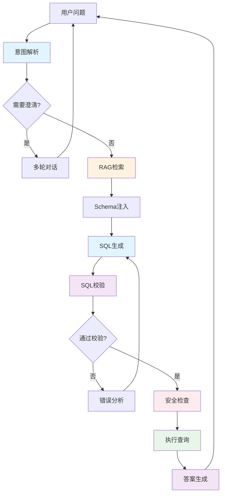

## 课程背景

在AI时代，让普通用户通过自然语言查询数据库已成为重要需求。然而，构建一个**真正可用**的NL2SQL系统，远不止调用一次LLM那么简单。

你需要考虑：
- ❓ 如何让LLM理解复杂的数据库Schema？
- 🔍 生成的SQL如何保证正确性和安全性？
- 🤖 如何处理用户的模糊问题和行业黑话？
- 🔗 多表关联查询如何生成？
- 💬 如何将查询结果转为自然语言回答？
- 🚀 如何部署成可用的生产系统？

本课程将**系统化地回答这些问题**，带你构建一个完整的NL2SQL解决方案。

### 必须掌握
- ✅ Python基础（函数、类、装饰器）
- ✅ 基本SQL语法（SELECT、WHERE、JOIN）
- ✅ Git基础操作（clone、checkout、commit）

### 环境准备
- Python 3.8+
- Git
- 代码编辑器（VS Code推荐）
- DeepSeek或Qwen API Key

## NL2SQL 系统架构

一个完整的NL2SQL系统应该包含以下组件：

### 核心流程

1. **意图解析** (M0)：理解用户问题类型
2. **澄清对话** (M7)：处理模糊问题
3. **RAG增强** (M6)：检索业务知识和历史SQL
4. **Schema注入** (M3)：提供数据库结构信息
5. **SQL生成** (M1)：通过Prompt生成SQL
6. **SQL校验** (M4)：验证语法和逻辑
7. **安全检查** (M5)：防止危险操作
8. **执行查询** (M2)：通过Function Call执行
9. **答案生成** (M9)：将结果转为自然语言
